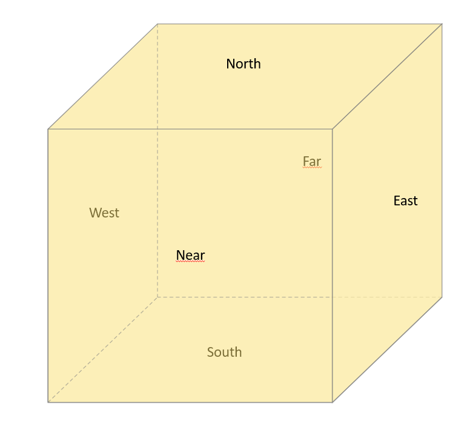

# Pytorch2Tikz
[//]: # "[](https://doi.org/10.5281/zenodo.2526396)"

Generate Tikz figures for neural networks implemented in pytorch. It uses LaTeX snippets from [PlotNeuralNet](https://github.com/HarisIqbal88/PlotNeuralNet) but you can now just run your network to plot everything automatically. For examples see `./examples`.

- [Pytorch2Tikz](#pytorch2tikz)
  - [Example](#example)
  - [Getting Started](#getting-started)
  - [Interface](#interface)
    - [Architecture](#architecture)
      - [Methods](#methods)
      - [Methods](#methods-1)
    - [Block](#block)
    - [Arguments](#arguments)
  - [Contributions](#contributions)
    - [Layer support](#layer-support)
    - [Custom Connection](#custom-connection)
    - [Colors](#colors)


## Example

```python
from pytorch2tikz import Architecture

print('Load model')
model = vgg16(True)

print('Load data')
...

print('Init architecture')
arch = Architecture(model)

print('Run model')
with torch.inference_mode():
    for image, _ in data_loader:
        image = image.to(device, non_blocking=True)
        output = model(image)

print('Write result to out.tex')
arch.save('out.tex')
```

## Getting Started
```
pip install pytorch2tikz
```

## Interface

### Architecture

```python
Architecture(module: nn.Module,
            block_offset=8,
            height_depth_factor=0.8,
            width_factor=0.8,
            linear_factor=0.8,
            image_path='./input_{i}.png',
            ignore_layers=['batchnorm', 'flatten'],
            colors=COLOR_VALUES)
```

#### Methods
Argument | description
---------|-------------
`module` | is the Model to plot
`block_offset` | offset to the next block; A block is created when the input dimensions change
`height_depth_factor` | scale the change of the next layer (last 2 dimensions); typically used to make the network a bit more compact
`width_factor` | scale the change of the next layer (first dimension); typically used to make the network a bit more compact
`linear_factor` | used when there is a drastic change in the last dimension (e.g. moving from conv to linear layers)
`image_path` | output path for recognized input images. `{i}` gets replaced by the current layer index
`ignore_layers` | define layers that should not be plotted. This can be a list of any substring of the `type(class)` (e.g. torch.nn.modules.batchnorm.BatchNorm)
`colors` | enum of colors. For an example check out `./pytorch2tikz/constants`

#### Methods
```python
def get_block(self, name: str) -> Block:
    ...
```

get a specific block to alter its properties

```python
def get_tex(self) -> str:
    ...
```

generate the tex code

```python
    
def save(self, file_path: str):
    ...
```

generate and save the tex code to the given path

### Block

```python
Block(name,
    fill: COLOR = COLOR.LINEAR,
    bandfill: COLOR = None,
    pictype = PICTYPE.BOX,
    opacity = 0.7,
    size = (10,40,40),
    default_size = DEFAULT_VALUE,
    dim = 3,
    scale_factor = np.zeros(3),
    offset: Tuple[int] = (0,0,0),
    to: Union[Tuple[int], Block] = (0,0,0),
    caption = " ",
    xlabel = True,
    ylabel = False,
    zlabel = True)
```

### Arguments

Argument | Description
---------|------------
`name`   | arbitrary name of the block. Should be unique, and typically the layers id is used
`fill`   | filling color as hex string, e.g. `#000000`
`bandfill`| filling of subcolor at the right end of a box. `pictype` should be `PICTYPE.RIGHTBANDEDBOX` ot be displayed
`pictype` | one of [`PICTYPE.BOX`, `PICTYPE.RIGHTBANDEDBOX`]
`opacity` | opacity of the filling
`size`    | size of the box
`default_size` | Size used for dimensions which are "flat": e.g. for 1D inputs the size (default, default, size) is used.
`dim`     | dimensionality of the block, e.g. 1 for Linear layers, 3 for conv2d layers (channels x dim1 x dim2)
`scale_factor` | scale factors to alter the size when outputting tex to make the figure more compact
`offset` | offset to the references position/block in `to`
`to`     | position tuple or block used for relative positioning
`capition`| caption of the block. Use an empty string if no caption is wanted
`xlabel` | display label for 1st dimension
`ylabel` | display label for 2nd dimension
`zlabel` | display label for 3nd dimension

## Contributions

Thank you for share your improvements to this package!

### Layer support
Please don't hesitate to add blocks for unsupported layers under `pytorch2tikz/block/D<x>.py` with `x` being the dimensionality of your layer. If your layer exists for multiple dimensions, choose `Dn.py`:

1. add your block definition under `pytorch2tikz/block/D<x>.py`
2. add mapping of type string to `pytorch2tikz/mapping.py`
3. add your color to `pytorch2tikz/constants.py` (see `Colors`)

### Custom Connection
For custom connections that can be added in postprocessing of an architecture like residual connections, add your desired connection in `pytorch2tikz/block/connections.py`. See the examples there as a guidance. For existing connections there are a bunch of defined positions for each block:



Each position can be combined with `(padding-)(near|far)(north|south)(east|west)`.

### Colors

Colors are defined in `pytorch2tikz/constants.py`. For each color there must exist an entry in the enum `COLOR` and the defined value in the Dict `COLOR_VALUES`. Make sure your color is easily distinguishable from other layers.